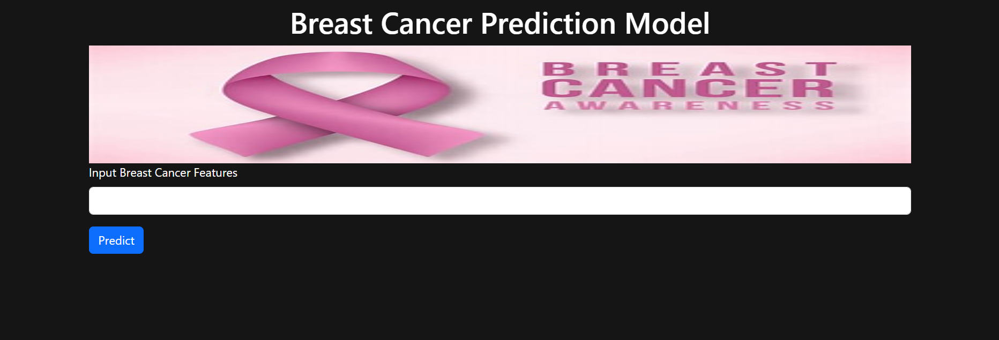

# 🩺 Breast Cancer Diagnosis  

A machine learning project for predicting breast cancer diagnosis using **Logistic Regression**, built with Python. The model analyzes patient data (proteins, tumor stage, histology, etc.) and classifies cases for better decision-making.  

  

---

## ✨ Features  

- 📊 *Data preprocessing* and cleaning of medical dataset  <br/>
- 🤖 *Logistic Regression model* for classification  <br/>
- 📈 *Performance evaluation* with accuracy and metrics  <br/>
- 🧪 *Exploratory Data Analysis (EDA)* with visualizations  <br/>
- ⚡ *Lightweight, simple & effective*  <br/>

---

## 📦 Project Structure

breast-cancer-diagnosis/ <br/> 
├── dataset.csv # Dataset used for training/testing <br/>
├── breast_cancer.ipynb # Jupyter Notebook with model & analysis <br/>
├── model.pkl # Saved Logistic Regression model <br/>
├── requirements.txt # Required dependencies <br/>
└── README.md # Project documentation <br/>

--

## 🚀 Getting Started  

1. **Clone the repository**  
   ```bash
   git clone https://github.com/delljigyanshu/Breast-cancer-diagnosis.git
   cd Breast-cancer-diagnosis
   ```
2. **Install dependencies**
  ```bash
  pip install -r requirements.txt
```
3. Run the notebook

  Open breast_cancer.ipynb in Jupyter Notebook / Jupyter Lab.
  Execute the cells step by step to train, evaluate, and test predictions.

## 🛠 Built With
- Python 🐍
- Pandas
- NumPy
- Matplotlib
- Scikit-learn (Logistic Regression)
- Jupyter Notebook

--

## ✏ Customization Ideas
🔍 Try other ML models (Random Forest, SVM, XGBoost) for better accuracy <br/>
📊 Add more visualizations for dataset insights <br/>
🌐 Deploy as a Flask/Django web app for interactive predictions <br/>
🧑‍⚕️ Integrate with real-time medical data sources <br/>

--
## 🙋‍♂ Author
 Jigyanshu Agrawal <br/>
GitHub: [@delljigyanshu](https://github.com/delljigyanshu) <br/>
LinkedIn: [Jigyanshu Agrawal](https://www.linkedin.com/in/jigyanshu-agrawal?utm_source=share&utm_campaign=share_via&utm_content=profile&utm_medium=android_app )
